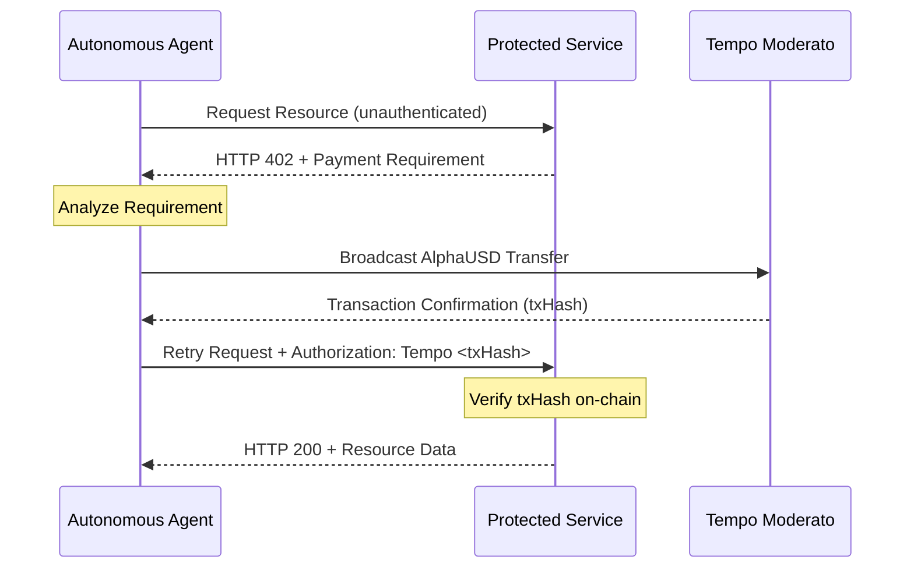

# Architecture Overview

**Verification Infrastructure for Autonomous Settlement.**

The Tempo Agentic Layer provides a technical framework for gating API access based on financial settlement. It implements the HTTP 402 (Payment Required) standard, requiring verifiable on-chain evidence of payment before granting resource access.

---

## 🛰️ The 402 Settlement Flow

The framework implements a "Challenge-Response" protocol for financial transactions:

### 1. The Challenge (HTTP 402)
When an unauthenticated request is received, the server responds with a 402 status code and a `WWW-Authenticate` header containing the payment details:
- `asset`: The AlphaUSD contract address.
- `amount`: The required fee in atomic units.
- `destination`: The service provider's wallet address.

### 2. Settlement Execution
The `@tempo/402-sdk` parses the 402 challenge details. If authorized by the agent's internal logic, the SDK executes a Transfer transaction on Tempo Moderato.

### 3. Verification & Authorization
The `@tempo/402-server` middleware intercepts the retry request. It verifies the transaction hash on-chain by checking:
- **Recipient Alignment**: Confirms the recipient matches the service provider's configuration.
- **Amount Fulfillment**: Checks if the transferred volume meets the requirement.
- **Temporal Validity**: Ensures the transaction occurred within the allowed age window.
- **Uniqueness**: Confirms the hash has not been previously utilized (Replay Protection).

---

## 🛠️ Core Components

The framework is built from modular primitives, allowing for deep integration into diverse technical architectures.

### Replay Protection
To prevent double-spending and "replay attacks," the server maintains a time-to-live (TTL) cache of verified transaction hashes. Any attempt to reuse a hash is immediately rejected with a 402 challenge.

### Verification Coalescing
To optimize infrastructure utilization, concurrent verification requests for the same transaction hash are deduplicated. This reduces the frequency of JSON-RPC calls to the Tempo network.

### Settlement Finality
Leveraging AlphaUSD on Tempo Moderato provides deterministic settlement finality. Unlike traditional payment protocols, confirmed on-chain transactions are immutable and lack chargeback risk.

---

## 🤖 Agentic Fundamentals

The Layer is designed to fit naturally into autonomous workflows:
- **ReAct Loops**: Agents can incorporate the 402 challenge into their observation phase.
- **Planning**: Cost-discovery occurs at the protocol level, allowing agents to plan budget allocations before execution.
- **Deterministic Failures**: Clear error codes (e.g., `INSUFFICIENT_FUNDS`, `NETWORK_ERROR`) allow for graceful fallback and retry logic.

---

Next Steps: [Integration Guides](./guides/express-integration.md) | [API Reference](./api/agent-sdk.md)
