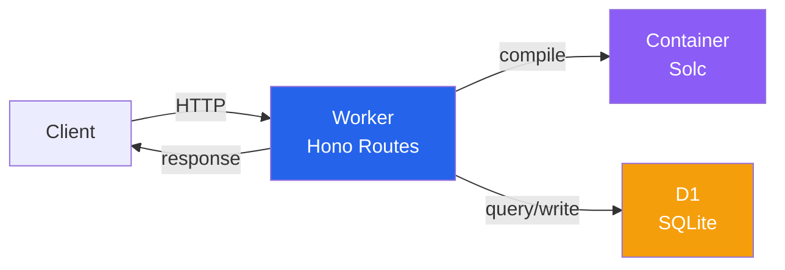

# Tempo Contract Verification Service

[contracts.tempo.xyz/docs](https://contracts.tempo.xyz/docs)

Sourcify-compatible smart contract verification service. Currently supports Tempo Testnet and Devnet.

## Architecture



## API Endpoints

### Verification

- `POST /v2/verify/:chainId/:address` - Verify contract with source code
- `GET /v2/verify/:verificationId` - Check verification status

### Lookup

- `GET /v2/contract/:chainId/:address` - Get verified contract details
- `GET /v2/contract/all-chains/:address` - Find contract across all chains
- `GET /v2/contracts/:chainId` - List all verified contracts on a chain

### Usage

#### With [Foundry](https://getfoundry.sh)

Pass the API URL to the `--verifier-url` flag and set `--verifier` to `sourcify`:

```bash
forge script script/Mail.s.sol --verifier-url https://contracts.tempo.xyz --verifier sourcify
```

See [/apps/contract-verification/scripts/quick-verify.sh](./scripts/quick-verify.sh) for and small example you can run.

#### Direct API Usage

- Standard JSON: see [/apps/contract-verification/scripts/verify-with-curl.sh](./scripts/verify-with-curl.sh) for a full example.
