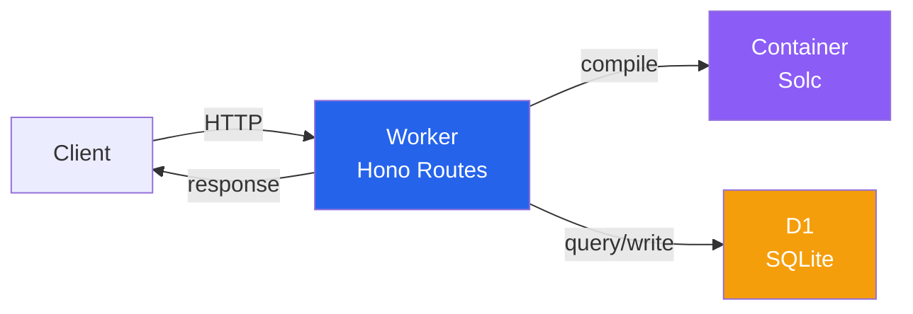

# Tempo Contract Verification Service

[contracts.tempo.xyz/docs](https://contracts.tempo.xyz/docs)

Sourcify-compatible smart contract verification service. Currently supports Tempo Testnets and Devnets.

## Architecture



## API Endpoints

### Verification

- `POST /v2/verify/:chainId/:address` - Verify contract with source code
- `GET /v2/verify/:verificationId` - Check verification status

### Lookup

- `GET /v2/contract/:chainId/:address` - Get verified contract details
- `GET /v2/contract/all-chains/:address` - Find contract across all chains
- `GET /v2/contracts/:chainId` - List all verified contracts on a chain

### Usage

#### With [Foundry](https://getfoundry.sh)

Pass the API URL to the `--verifier-url` flag and set `--verifier` to `sourcify`:

```bash
forge script script/Mail.s.sol --verifier-url https://contracts.tempo.xyz --verifier sourcify
```

See [/apps/contract-verification/scripts/quick-verify.sh](./scripts/quick-verify.sh)
and [/apps/contract-verification/scripts/medium-verify.sh](./scripts/medium-verify.sh) for small examples you can run.

#### Direct API Usage

- Standard JSON: see [/apps/contract-verification/scripts/verify-with-curl.sh](./scripts/verify-with-curl.sh) for a full example.

### Development

#### Prerequisites

- A container runtime (e.g., [OrbStack](https://docs.orbstack.dev), [Colima](https://github.com/abiosoft/colima), Docker Desktop)

```sh
cp .env.example .env  # Copy example environment variables
pnpm install          # Install dependencies
pnpm dev              # Start development server
```

Once dev server is running, you can run scripts in the [/apps/contract-verification/scripts](./scripts) directory to populate your local database with verified contracts.

#### Database

We use [D1](https://developers.cloudflare.com/d1), a serverless SQLite-compatible database by Cloudflare.
Sometimes you need to debug the local database in development,
especially when it's SQLite. Sadly, wrangler doesn't have a nice way to do this.

Improvised solution: we [locate the local SQLite file wrangler uses](/apps/contract-verification/scripts/local-d1.sh) and run drizzle-kit studio to view it.

| environment | database | dialect | GUI |
|-------------|----------|----------|-----|
| production  | Cloudflare D1 | SQLite | [DrizzleKit Studio](https://github.com/drizzle-team/drizzle-studio) |
| development | Local SQLite | SQLite | [Cloudflare Dashboard](https://dash.cloudflare.com/) |
