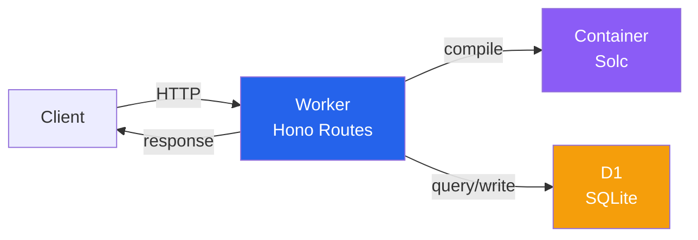

# Tempo Contract Verification Service

[contracts.tempo.xyz/docs](https://contracts.tempo.xyz/docs)

Sourcify-compatible smart contract verification service. Currently supports Tempo Testnets and Devnets.

## Architecture


```mermaid
graph LR
    Client["Client"]
    Worker["Worker<br/>Hono Routes"]
    Container["Container<br/>Solc"]
    D1["D1<br/>SQLite"]
    
    Client -->|HTTP| Worker
    Worker -->|compile| Container
    Worker -->|query/write| D1
    Worker -->|response| Client
    
    style Worker fill:#2563eb,color:#fff
    style Container fill:#8b5cf6,color:#fff
    style D1 fill:#f59e0b,color:#fff
```

## API Endpoints

### Verification

- `POST /v2/verify/:chainId/:address` - Verify contract with source code
- `GET /v2/verify/:verificationId` - Check verification status

### Lookup

- `GET /v2/contract/:chainId/:address` - Get verified contract details
- `GET /v2/contract/all-chains/:address` - Find contract across all chains
- `GET /v2/contracts/:chainId` - List all verified contracts on a chain

### Usage

#### With [Foundry](https://getfoundry.sh)

Pass the API URL to the `--verifier-url` flag and set `--verifier` to `sourcify`:

```bash
forge script script/Mail.s.sol --verifier-url https://contracts.tempo.xyz --verifier sourcify
```

See [/apps/contract-verification/scripts/verify-solidity.sh](./scripts/verify-solidity.sh)
and [/apps/contract-verification/scripts/verify-vyper.sh](./scripts/verify-vyper.sh) for small examples you can run.

#### Direct API Usage

- Standard JSON: see [/apps/contract-verification/scripts/verify-via-curl.sh](./scripts/verify-via-curl.sh) for a full example.

### Development

#### Prerequisites

- A container runtime (e.g., [OrbStack](https://docs.orbstack.dev), [Colima](https://github.com/abiosoft/colima), Docker Desktop)

```sh
cp .env.example .env  # Copy example environment variables
pnpm install          # Install dependencies
pnpm dev              # Start development server
```

Once dev server is running, you can run scripts in the [/apps/contract-verification/scripts](./scripts) directory to populate your local database with verified contracts.

#### Database

We use [D1](https://developers.cloudflare.com/d1), a serverless SQLite-compatible database by Cloudflare.
For local development, keep migrations and seeding separate:

```bash
pnpm db:prepare:local  # Apply local D1 migrations non-interactively
pnpm db:seed:local     # Seed native/precompile contract metadata into local D1
```

For remote D1:

```bash
pnpm db:prepare:remote # Apply remote D1 migrations non-interactively
pnpm db:seed:remote    # Seed native/precompile contract metadata into remote D1
```

The seed script uses Wrangler's D1 binding path rather than opening the SQLite file directly, so the same seeding logic works for both local and remote D1.

Rerunning the seed refreshes each `(contract, from_block)` snapshot in place,
preserving its revision ID. Metadata and source links are replaced atomically per
deployment, including removal of obsolete paths; other activation blocks are
unchanged. A partially completed seed can be rerun without deleting existing rows.

The native manifest covers Tempo's 15 fixed precompiles and the shared TIP-20
implementation. It pins Rust source snapshots and records activation versions;
these are native-source records, not Solidity bytecode verification. All entries
share the `tempoCommit` snapshot declared in the manifest. Review snapshot/ABI
alignment and activation metadata before publishing updates.

Seeded pathUSD provides the TIP-20 source template. Single-chain address lookups
reuse it for other TIP-20 addresses on the static Tempo networks only after RPC
confirms the native `0xef` code marker. Uninitialized addresses return 404; RPC
failures return an error rather than claiming verification. This lookup does not
write token instances to D1, so list/all-chains endpoints enumerate stored records
only.

The Zone Portal implementation, Zone Messenger, and Zone Verifier are seeded
individually as Solidity `system_contract` source records from the pinned
`zonesCommit`. These expose sources with `bytecodeVerified: false`, not a compiled
bytecode match. The Zone Factory retains its Rust precompile record.

Portal instance lookups reuse the implementation's sources and ABI, like TIP-20s
reuse pathUSD. They require a nonzero zone ID in the full reserved address prefix,
a static Tempo chain, a seeded implementation, and the exact ERC-1167 runtime
targeting that implementation. Empty accounts, native markers, and proxies to
other implementations do not qualify. Instances are not inserted into D1. Rerun
`pnpm db:seed:remote` after deployment to publish the singleton source records;
new portal instances then resolve without further seeding. Review and refresh
the pinned Solidity snapshot when protocol upgrades change the shared runtimes.

`pnpm db:studio` uses the Drizzle D1 HTTP config. If you need to inspect the local SQLite file directly, resolve it with [local-d1.ts](./scripts/local-d1.ts) and point a SQLite-capable tool at that path instead.

| environment | database      | dialect | GUI                                                                 |
|-------------|---------------|---------|---------------------------------------------------------------------|
| production  | Cloudflare D1 | SQLite  | [DrizzleKit Studio](https://github.com/drizzle-team/drizzle-studio) |
| development | Local SQLite  | SQLite  | [local-d1.ts](./scripts/local-d1.ts) + your SQLite tool of choice   |
